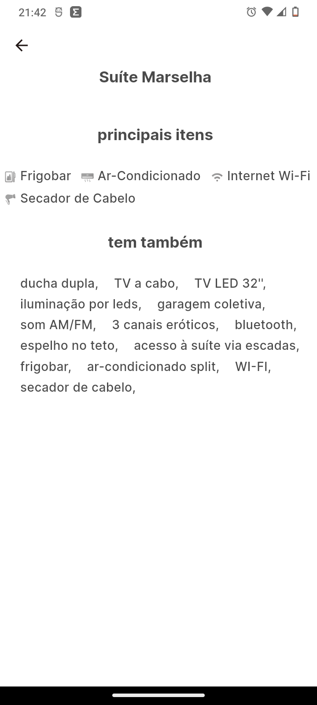
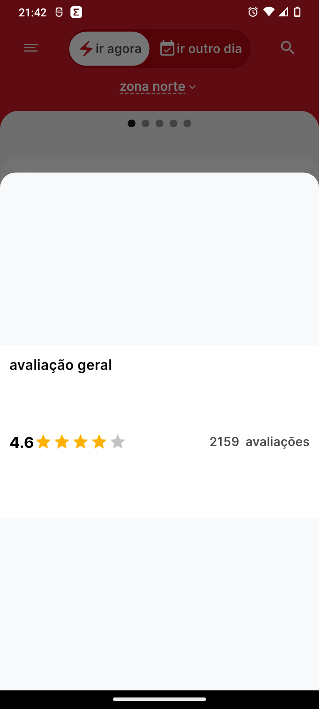

# 📱 go

Este aplicativo apresenta um guia motéis, permitindo o usuário visualizar com bastante detalhes e decidir o melhor custo beneficio.

## 🚀 Tecnologias Utilizadas

- **Linguagem:** Dart
- **Framework:** Flutter
- **Arquitetura:** MVVM + Clean Archtecture
- **Padrão de UI:** Widgets e Views
- **Gerenciamento de estado:** flutter_bloc e provider
- **Adaptação no Backend:** Foi desenvolvido um endpoint com uma micro API em Node.js serveless hospedada no Firebase functions.

## 📸 Capturas de Tela

<p align="center">
  
  
  
  
</p>

## ✅ Unit Tests

O projeto inclui testes unitários para garantir a qualidade do código. Os testes são escritos utilizando `mockito` para simulação de dependências e `flutter_test` para validação de widgets.

Para executar os testes, utilize o seguinte comando:

```sh
flutter test 'caminho/para/o/test.dart'
```

## 🛠 Dependências Externas

As seguintes bibliotecas foram utilizadas no projeto:

```yaml
dependencies:
  flutter:
    sdk: flutter

  cupertino_icons: ^1.0.8
  equatable: ^2.0.7
  flutter_bloc: ^9.0.0
  flutter_svg: ^2.0.17
  google_fonts: ^6.2.1
  http: ^1.2.2
  bloc_concurrency: ^0.3.0
  carousel_slider: ^5.0.0
  provider: ^6.1.2

dev_dependencies:
  flutter_test:
    sdk: flutter

  flutter_lints: ^5.0.0
  build_runner: ^2.4.14
  mockito: ^5.4.5
  bloc_test: ^10.0.0
```

## 📂 Estrutura do Projeto

```
lib/
├── app/
│   ├── app.dart
│   ├── models/
│   │   ├── categoria_item_model.dart
│   │   ├── desconto_model.dart
│   │   ├── item_model.dart
│   │   ├── motel_model.dart
│   │   ├── periodo_model.dart
│   │   └── suite_model.dart
│   ├── repositories/
│   │   └── motel_repository.dart
│   ├── services/
│   │   ├── assets.dart
│   │   └── motel_carousel_provider.dart
│   ├── viewmodel/
│   │   ├── motel_bloc.dart
│   │   ├── motel_event.dart
│   │   └── motel_state.dart
│   └── views/
│       ├── pages/
│       │   ├── category_item_page.dart
│       │   ├── home_page.dart
│       │   ├── image_grid_page.dart
│       │   ├── suite_page.dart
│       │   └── under_construction_page.dart
│       ├── atoms/
│       │   ├── custom_app_bar.dart
│       │   ├── custom_floating_button.dart
│       │   ├── home_body.dart
│       │   └── loading_widget.dart
│       ├── molecules/
│       │   ├── error_widget.dart
│       │   ├── motel_carousel_item.dart
│       │   ├── motel_carousel.dart
│       │   ├── slider_dots.dart
│       │   ├── suite_category_item.dart
│       │   ├── suite_display.dart
│       │   ├── suite_header.dart
│       │   ├── suite_list_view.dart
│       │   └── suite_periodos.dart
├── core/
│   ├── extensions/
│   │   ├── context_ext.dart
│   │   ├── string_ext.dart
│   ├── providers/
│   │   └── toggle_provider.dart
│   │   ├── motel_carousel_provider.dart
│   ├── services/
│   │   └── styles.dart
│   │   ├── assets.dart
│   ├── utils/
│   │   ├── core_utils.dart
│   │   ├── typedefs.dart
│   │   └── constatans.dart
│   ├── errors/
│   │   ├── exceptions.dart
│   ├── enums/
│   │   └── model_type.dart
│   ├── environments/
│   │   └── environments.dart
├── assets/
│   ├── icons/
│   │   └── menu.svg
│   ├── images/
│   │   └── under_construction.jpg
└── main.dart


```

## 📌 Instruções para Execução

### Pré-requisitos

Certifique-se de ter instalado:

- [Flutter](https://flutter.dev/docs/get-started/install)
- Dart
- Emulador ou dispositivo físico

### Como rodar o projeto

Clone o repositório:

```sh
git clone https://github.com/alexomantovani/go.git
cd go
```

Instale as dependências:

```sh
flutter pub get
```

Execute o aplicativo:

```sh
flutter run
```
